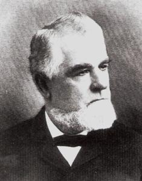

<gen=g5>

<b>James Martin Foster</b>

b Apr 23 1831 Monroe Co., AL

d Dec 12 1900 Shreveport, Caddo Parish, LA

f [Flavel Foster](../g6/flavel_foster.md)

m [Mary Amelia Hollingsworth](../g6/mary_amelia_hollingsworth.md)

o [Mary Eleanor Long](mary_eleanor_long.md)

- Ernest Flavel Foster 1860-1862
- [William Long Foster](../g4/william_long_foster.md)
- James Martin Foster 1871-1928
- John Gray Foster 1878-1901
- Theresa Olive Foster 1879-1920
- Lucile (McMillin) Foster 1879-1949
- Newton Blanchard Foster 1880-1881
- Erastus Fullilove Foster 1884-1888

[ref](https://www.findagrave.com/memorial/48101097/james-martin-foster)

Buried at Oakland Cemetery, Shreveport.

Possibly birth date Apr 25 based on obit.  Attended Western Military Institute at Drennon Springs, KY.  He and his two brothers served in the Confederate army.  Jacob Flavel Foster was killed at Chancellorsville.

JM is called Captain, but he did not serve, instead stayed to manage to plantation.

Not clear on who is related to 

- Claiborne Lee Foster 1868-1888 (killed at Fort Reno).

There is also a James Madison Hollingsworth (cousin?) born 1830 Monroe Co., AL.  He served as a CSA Captain, Co. F, 19th Louisiana Infantry.  Promoted to Colonel.  Fought at Shiloh.