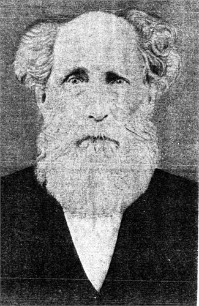

<gen=g6>

<b>David West</b>

b Jan 09 1792 Swansboro, Onslow Co., NC

d May 13 1880 Pope Co., AS

f [Andrew West](../g7/andrew_west.md)

m [Tryphenia Mets/Mead](../g7/tryphenia_metts_mead.md)

o Millet Payne {Milly}

- Joseph
- Warren M.
- Caroline
- Phoebe Jane,
- Thomas B.
- Washington
- David Porter
- Eliza Ann
- Victoria Alexander

o Lucinda Lattimer

- Erastus Latimore
- Tryphenia
- Andrew North
- Alexader Hamilton
- [Abby Ann](../g5/abby_ann_west.md)
- Daniel Webster
- [John Bell](../g5/john_bell_west.md)
- Emma B.

o1 Nov 11 1816 Cross Plains, Robertson Co., TN

o2 May 11 1841 Dover, Pope Co., AS

[grave](https://www.findagrave.com/memorial/31169496/david-west)

[data](../family_data/johnson/david_west.txt)

