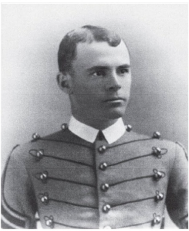

<gen=g4>

<b>Claiborne Lee Foster</b>

b Jun 11 1865 De Soto Parish, LA

d Aug 10 1890 Fort Reno, Indian Territory (OK)

f [James Martin Foster](../g5/james_martin_foster.md)

m [Mary Eleanor Long](../g5/mary_eleanor_long.md)

o

Buried at Oakland Cemetery, Shreveport.

[grave](https://www.findagrave.com/memorial/23880509/claiborne-lee-foster)

Graduate of West Point, class of 1888.  Died while on duty at Fort Reno, Indian Territory, from a fever, according to [ref](https://books.google.com/books?id=UeO2CwAAQBAJ&dq=claiborne+lee+foster&source=gbs_navlinks_s)

