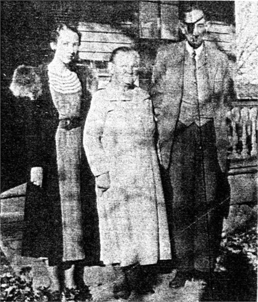

<gen=g5>

<b>John Bell West</b>

b May 11 1857

d Jul 24 1946 Dover, Pope Co., AS

f [David West](../g6/david_west.md) 1792-1880

m [Lucinda Latimer](../g6/lucinda_latimer.md) (West) 1821-1903

o Margaret Ellen Phillipps

- Mary Ruth (Neal) 1881-1968
- David 1886-1962
- Sally (Turner) 1890-1982
- Emma (Jones) 1892-1964
- Dewey 1898-1983

o b Feb 4 1861 d Aug 19 1947

Buried at McFadden Cemetery
Dover, Pope County, Arkansas, USA

[J.B. West grave](https://www.findagrave.com/memorial/43770484/john-bell-west/photo#view-photo=71774435)

This is the J.B. West of Pope Co. that A.A. Johnson used to visit, according to Robin Fowler.

Invested in railroad from Russellville via Taral to Dover

The Railway Age
March 6 1903

This picture is from Find a grave.

