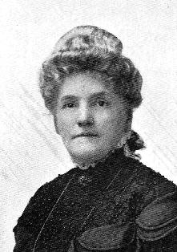

<gen=g5>

<b>Mary Eleanor Long</b> <b>(Foster) {Nellie}</b>

b 1842

d Nov 16 1910 Caddo Parish, LA

f [William Long](../g6/william_long.md)

m [Emily C. Boggs](../g6/emily_boggs.md)

o [James Martin Foster](james_martin_foster_1831.md)

- Ernest Flavel 1860-1862
- [William Long Foster](../g4/william_long_foster.md) 1861-1916
- [Claiborne Lee Foster](../g4/claiborne_lee_foster.md) 1865-1888
- [James Martin Foster](../g4/james_martin_foster_1871.md) 1871-1928
- John Gray 1878-1901
- Theresa Olive Foster 1879-1920
- Lucile (McMillin) 1879-1949
- Newton Blanchard 1880-1881
- Erastus Fullilove 1884-1888

missing some

Known as "Nellie" and also Ellen (gravestone).

Buried at Oakland Cemetery, Shreveport.

Bio in [ref](https://www.findagrave.com/memorial/48101031/mary-ellen-foster)

Moved from the plantation to Shreveport when first five children were young (11 altogether).  House was called "Curraghmuir".

"Dr. William Long en 1840 married Miss Emily C. Boggs, a native of Berkley County, Virginia, and daughter of Rev. Dr. John Boggs, a graduate of Princeton University and a Presbyterian minister. Through her mother Mrs. Foster was a direct descendant of Col. Ellis Cook, a personal friend of George Washington and commander of a battalion in the Revolution."
