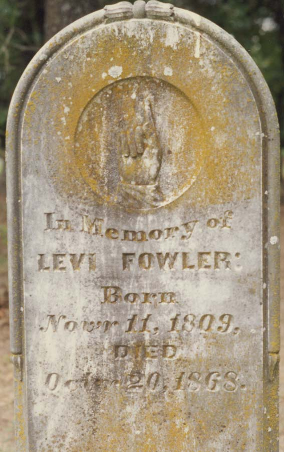

<gen=g6>

<b>Levi Fowler</b>

b Nov 11 1809 Parrotsville, Cocke Co., TN

d Oct 20 1868 Johnson Co., TX

f [Thomas Fowler](../g7/thomas_fowler_1770.md) 1770-1840

m [Mary Baldridge](../g7/mary_baldridge.md)

o [Dinelah Huff](dinelah_huff.md)

- James Henderson 1834-1916
- [Thompson Fletcher Fowler](../g5/thompson_fletcher_fowler.md) 1836-1886
- [Tillman Fowler](../g5/tilman_fowler.md) 1839-1923
- Mary Ellen 1841-1909
- Levi 1843-1930
- Newton 1850-1868

[ref](http://freepages.rootsweb.com/~fowler/genealogy/combined/fam15054.htm)
used for rest of the family tree.

[grave](https://www.findagrave.com/memorial/22092513/levi-fowler)

According to Hiram Fowler (his nephew) in 1853 Levi Fowler was near Spicewood TX NW of Austin.

